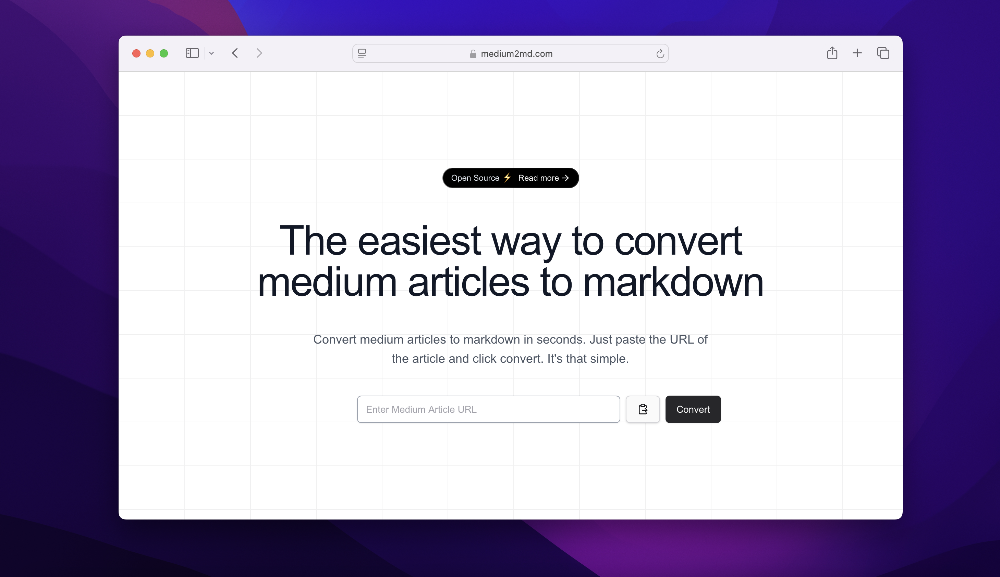

# medium2md.com

<!-- [](LICENSE)
[](https://github.com/yourusername/medium2md.com/actions) -->



## Introduction

**medium2md.com** is an open-source tool that converts Medium articles into Markdown format. It helps users back up their content, migrate articles to other platforms, or save them for offline reading.

## Table of Contents

- [Features](#features)
- [Installation](#installation)

## Features

- **Easy Conversion**: Quickly convert Medium articles to Markdown with minimal effort.
- **Customizable Output**: Choose to include or exclude images, links, and formatting styles.
- **Offline Reading**: Save articles in Markdown format for offline reading.

## Installation

Clone the repository and install the dependencies:

```bash
// Clone the repository
git clone https://github.com/marceloakalopes/medium2md.git

// Change directory
cd medium2md

// Install dependencies
npm install

// Run next application
npm run dev
```

